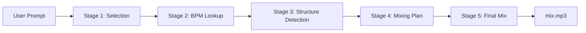

# AI DJ Mixing System

## Overview

The **AI DJ Mixing System** is a professional, AI-powered DJ mixing pipeline that creates seamless, radio-quality mixes from your local music library. Using advanced audio analysis, machine learning, and OpenAI's GPT models, it automatically selects tracks, analyzes their musical characteristics, detects optimal transition points, and creates professional DJ transitions with perfect beat-grid alignment, gradual tempo sync, and intelligent energy flow management.

### What Makes This Special?

This isn't just audio stitching—it's **real professional DJ technique** automated with cutting-edge AI:

- 🎯 **Intelligent Transition Detection** - AI finds 3 optimal transition points per song (verse_end, chorus_end, breakdown_start, pre_drop)
- 🎛️ **Perfect Beat-Grid Alignment** - Sample-accurate beat synchronization with downbeat matching
- 🌊 **Gradual Tempo Sync** - Professional CDJ-style tempo ramping (32 micro-steps) instead of instant stretching
- 📊 **Energy Curve Analysis** - Detects buildups, drops, and energy transitions for context-aware mixing
- 🎵 **Harmonic Mixing** - Uses the Camelot Wheel to ensure key compatibility
- 🔬 **Multi-Factor Scoring** - Evaluates 6 factors (genre, vocals, energy, keys, BPM, type) to select best transitions
- 🎚️ **Progressive EQ Filtering** - Prevents frequency mud during overlaps
- 🎼 **Phrase-Based Transitions** - Snaps to 8-bar musical boundaries for natural timing
- 🎧 **Genre-Adaptive Mixing** - Different strategies for Afrobeats, R&B, EDM, Hip-Hop, Dancehall
- ⚡ **Dynamic Overlap Duration** - 4-16 second transitions based on musical context

### From Natural Language to Professional Mix

Describe what you want in plain English, and the system handles everything:

```
"start with love me jeje, then sensational, work me out, and finally outside"
```

The system will:

1. **Select** matching songs from your `./songs/` folder using OpenAI GPT-4o
2. **Analyze** each track with librosa (BPM, energy, key, phrase boundaries)
3. **Detect** 3 transition candidates per song using GPT-4o + energy curve analysis
4. **Score** each transition point using intelligent multi-factor algorithm
5. **Align** beats perfectly with beat-grid warping and downbeat synchronization
6. **Sync** tempos gradually (32 micro-steps) for inaudible transitions
7. **Mix** with professional EQ filtering and harmonic compatibility
8. **Export** a polished `output/mix.mp3` ready to play

---

## ✨ Key Features (Latest Updates)

| Feature                                 | Description                                                              | Status               |
| --------------------------------------- | ------------------------------------------------------------------------ | -------------------- |
| **🎤 Natural Language Input**           | Describe your mix requirements in plain English                          | ✅ Fully Implemented |
| **🎵 Smart Track Selection**            | OpenAI GPT-4o analyzes your library and picks matching songs             | ✅ Fully Implemented |
| **🎯 Intelligent Transition Detection** | AI finds 3 optimal exit points per song (breakdown, verse end, pre-drop) | ✅ NEW               |
| **📊 Energy Curve Analysis**            | Detects buildups, drops, and energy transitions for smart mixing         | ✅ NEW               |
| **🔬 Multi-Factor Transition Scoring**  | 6-factor algorithm (genre, vocals, energy, keys, BPM, type)              | ✅ NEW               |
| **🎛️ Perfect Beat-Grid Alignment**      | Sample-accurate beat sync with downbeat matching & micro-corrections     | ✅ NEW               |
| **🌊 Gradual Tempo Sync**               | CDJ-style tempo ramping (32 micro-steps) instead of instant stretch      | ✅ NEW               |
| **🎼 Harmonic Mixing (Camelot Wheel)**  | Ensures key compatibility between transitions                            | ✅ Fully Implemented |
| **🎚️ Professional EQ Filtering**        | Progressive Butterworth filters (low-pass/high-pass)                     | ✅ Fully Implemented |
| **📐 Phrase-Based Transitions**         | Snaps to 8-bar musical boundaries                                        | ✅ Fully Implemented |
| **🎧 Genre-Specific Rules**             | Afrobeats, R&B, EDM, Hip-Hop, Dancehall adaptive mixing                  | ✅ Enhanced          |
| **⚡ Dynamic Overlap Duration**         | 4-16 second transitions based on context                                 | ✅ Fully Implemented |
| **💾 Intelligent Caching**              | Stores analysis results in `notes/` for instant re-runs                  | ✅ Fully Implemented |
| **🎬 OpenAI Whisper Integration**       | Fast vocal/structure detection via API                                   | ✅ Fully Implemented |
| **📈 Automatic BPM Correction**         | Fixes 2x/0.5x detection errors in slow R&B/Afrobeats                     | ✅ NEW               |

### Professional DJ Improvements

Our system implements **10 advanced DJ techniques**:

1. **Intelligent Transition Detection** - AI-selected optimal exit points (not fixed timestamps)
2. **Energy Curve Analysis** - Detects buildups/drops for perfect timing
3. **Multi-Factor Scoring** - Context-aware transition selection
4. **Perfect Beat Alignment** - Sample-accurate synchronization with beat-grid warping
5. **Gradual Tempo Sync** - Professional CDJ-style ramping (32 micro-steps)
6. **EQ Filtering** - Prevents muddy sound during transitions
7. **Harmonic Mixing** - Uses music theory for perfect key compatibility
8. **Dynamic Overlap** - Adjusts transition length intelligently
9. **Phrase Boundaries** - Transitions at natural musical breaks
10. **Genre Rules** - Different strategies per music style

---

## 📋 Prerequisites

| Requirement             | Version | Installation                                                      |
| ----------------------- | ------- | ----------------------------------------------------------------- |
| **Python**              | 3.8+    | [Download Python](https://www.python.org/downloads/)              |
| **FFmpeg**              | Latest  | [Download FFmpeg](https://ffmpeg.org/download.html) - Add to PATH |
| **OpenAI API Key**      | -       | Get from [platform.openai.com](https://platform.openai.com)       |
| **Local Music Library** | -       | Place MP3 files in `./songs/` folder                              |

### System Requirements

- **RAM**: 4GB minimum (8GB recommended for large libraries)
- **Storage**: ~500MB for dependencies + your music library
- **CPU**: Modern multi-core processor recommended for faster analysis

---

## 🚀 Installation

### 1. Clone the Repository

```bash
git clone https://github.com/kckDeepak/AI-DJ-Mixing-System.git
cd AI-DJ-Mixing-System
```

### 2. Create Virtual Environment (Recommended)

```bash
# Windows
python -m venv myenv
myenv\Scripts\activate

# macOS/Linux
python3 -m venv myenv
source myenv/bin/activate
```

### 3. Install Dependencies

```bash
pip install -r requirements.txt
```

**Core dependencies installed:**

- `librosa` - Audio analysis and beat detection
- `pydub` - Audio manipulation and mixing
- `scipy` - Signal processing for EQ filters
- `numpy` - Array operations
- `openai` - OpenAI API integration
- `python-dotenv` - Environment variable management

### 4. Install FFmpeg

**Windows:**

1. Download from [ffmpeg.org](https://ffmpeg.org/download.html)
2. Extract to `C:\ffmpeg`
3. Add `C:\ffmpeg\bin` to System PATH

**macOS:**

```bash
brew install ffmpeg
```

**Linux:**

```bash
sudo apt-get install ffmpeg  # Ubuntu/Debian
sudo yum install ffmpeg      # CentOS/RHEL
```

### 5. Configure API Keys

Create a `.env` file in the project root:

```env
OPENAI_API_KEY=sk-your-openai-api-key-here
```

Get your OpenAI API key from: https://platform.openai.com/api-keys

---

## 📁 Project Structure

```
AI-DJ-Mixing-System/
│
├── songs/                          # 🎵 Your MP3 library (INPUT)
│   ├── Artist - Song1.mp3
│   ├── Artist - Song2.mp3
│   └── ...
│
├── output/                         # 📤 Generated files (OUTPUT)
│   ├── analyzed_setlist.json      # Selected songs with OpenAI analysis
│   ├── basic_setlist.json         # BPM, genre, key metadata
│   ├── structure_data.json        # Chorus/vocal/transition points
│   ├── mixing_plan.json           # Professional DJ cue sheet
│   └── mix.mp3                    # 🎧 FINAL MIX (your result!)
│
├── notes/                          # 💾 Cached analysis (auto-generated)
│   ├── SongName_metadata.json     # BPM, key, energy, genre
│   └── SongName_structure.json    # Transition points, vocals
│
├── research_stuff/                 # 🔬 Experimental features
│   ├── denis_chorus.py            # Chorus detection research
│   ├── test_pychorus.py           # PyChorus experiments
│   └── openai/                    # OpenAI prompt experiments
│
├── older_way/                      # 📜 Previous pipeline version
│   ├── track_identification_engine.py  # Old Gemini-based approach
│   ├── track_analysis_engine.py        # Pre-librosa analysis
│   └── ...
│
├── run_pipeline.py                 # ▶️ MAIN ENTRY POINT
├── track_analysis_openai_approach.py  # Stage 1: Song selection
├── bpm_lookup.py                   # Stage 2: BPM/metadata enrichment
├── structure_detector.py           # Stage 3: Structure analysis
├── generate_mixing_plan.py         # Stage 4: Transition planning
├── mixing_engine.py                # Stage 5: Final mix generation
│
├── test_improvements.py            # ✅ Test suite for 7 features
├── requirements.txt                # 📦 Python dependencies
├── .env                            # 🔑 API keys (create this!)
└── README.md                       # 📖 This file
```

---

## 🎮 Usage

### Quick Start (3 Steps)

#### 1. Add Your Music

Place your MP3 files in the `songs/` folder:

```
./songs/
├── Michael Jackson - Billie Jean.mp3
├── Tyla - Jump.mp3
├── Anirudh - Why This Kolaveri Di.mp3
└── ...
```

**Supported file naming:**

- `Artist - Title.mp3` ✅
- `01 - Title.mp3` ✅
- `[Source] Title.mp3` ✅
- Any MP3 format ✅

#### 2. Run the Pipeline

```bash
python run_pipeline.py
```

The system will prompt you:

```
Enter your DJ mix request: Create a 5-song mix with upbeat energy
```

#### 3. Get Your Mix!

```
✅ Mix complete! → output/mix.mp3
```

### Advanced Usage

#### Customize the Prompt in Code

Edit `run_pipeline.py` (line ~70):

```python
user_input = (
    "Create a 10-song progressive mix starting from slowest BPM. "
    "Include these must-have tracks: "
    "Michael Jackson - Billie Jean, "
    "Tyla - Jump. "
    "Focus on R&B and Afrobeats genres."
)
```

#### Command-Line Options

The pipeline accepts natural language, so you can request:

- **Genre-specific mixes**: `"Mix 8 EDM tracks with high energy"`
- **BPM progression**: `"10 songs sorted slowest to fastest"`
- **Must-include tracks**: `"Must include Artist - Song and Artist2 - Song2"`
- **Energy levels**: `"Create a chill low-energy mix for background music"`

---

## 🔄 How the Pipeline Works

### The 5-Stage Process



### Stage-by-Stage Breakdown

#### **Stage 1: Song Selection** (`track_analysis_openai_approach.py`)

**What it does:**

- Scans your `./songs/` folder
- Uses OpenAI GPT-4o to understand your natural language prompt
- Selects best-matching songs based on genre, energy, artist, title
- **Optional**: Applies energy curve ordering (warm up → peak → cool down)

**Output:** `output/analyzed_setlist.json`

**Example:**

```json
{
  "analyzed_setlist": [
    {
      "time": "00:00",
      "analyzed_tracks": [
        {
          "title": "Billie Jean",
          "artist": "Michael Jackson",
          "file": "Michael Jackson - Billie Jean.mp3"
        }
      ]
    }
  ]
}
```

---

#### **Stage 2: BPM & Metadata Enrichment** (`bpm_lookup.py`)

**What it does:**

- Loads each MP3 file with librosa
- Detects BPM using beat tracking (NOT OpenAI - pure librosa!)
- Calculates energy level (RMS normalization: 0-1 scale)
- Uses OpenAI for genre and key detection (optional)
- **Caches results** in `notes/{song}_metadata.json` for instant re-runs

**Output:** `output/basic_setlist.json` + cached metadata

**Example metadata (`notes/` folder):**

```json
{
  "title": "Billie Jean",
  "artist": "Michael Jackson",
  "file": "Michael Jackson - Billie Jean.mp3",
  "bpm": 117,
  "genre": "Pop",
  "key": "F#m",
  "key_semitone": 18,
  "scale": "minor",
  "energy": 0.82
}
```

**Key Innovation:** Librosa-only BPM detection ensures accuracy without external API costs!

---

#### **Stage 3: Structure Detection** (`structure_detector.py`)

**What it does:**

- Uses OpenAI Whisper API for fast transcription
- Detects vocal presence in first 8 seconds (prevents vocal overlap)
- Finds optimal transition points using beat tracking
- Calculates **phrase boundaries** (every 8 bars = 32 beats)
- **Caches results** in `notes/{song}_structure.json`

**Output:** `output/structure_data.json` + cached structure

**Example structure:**

```json
{
  "has_vocals": true,
  "has_vocals_in_first_8s": false,
  "transition_point": 72.0,
  "intro_duration": 8.5
}
```

**Why this matters:**

- `has_vocals_in_first_8s`: If true, previous song must finish cleanly (no overlap)
- `transition_point`: Best time to start transitioning OUT
- `intro_duration`: Safe zone before vocals start

---

#### **Stage 4: Mixing Plan Generation** (`generate_mixing_plan.py`)

**What it does:**

- **Sorts songs by BPM** (lowest to highest) for smooth energy build
- Calculates **harmonic compatibility** using Camelot Wheel
- Determines **dynamic overlap duration** (4-16 seconds)
- Applies **genre-specific rules** (EDM = longer, Hip-Hop = shorter)
- **Snaps transitions to phrase boundaries** (8-bar alignment)

**Output:** `output/mixing_plan.json`

**Example plan:**

```json
{
  "mixing_plan": [
    {
      "from_track": "Billie Jean",
      "to_track": "Jump",
      "incoming_start_sec": 183.5,
      "start_time": "00:03:03",
      "transition_point": 192.0,
      "overlap_duration": 12.0,
      "transition_type": "Transition Overlap",
      "to_bpm": 120,
      "from_bpm": 117,
      "comment": "Billie Jean (BPM 117) -> Jump (BPM 120). Dynamic 12.0s overlap (no early vocals). ✓ Keys match (F#m→G). Transition at 192.0s, BPM change at 184.0s"
    }
  ]
}
```

**Professional Features:**

- ✅ **Harmonic mixing**: "Keys match (F#m→G)" or "⚠️ Key clash (C→F#)"
- ✅ **Dynamic overlap**: Adjusts based on BPM difference, key compatibility, genre
- ✅ **Vocal-aware**: Prevents overlapping vocals
- ✅ **Phrase alignment**: Transitions at natural musical breaks

---

#### **Stage 5: Final Mix Generation** (`mixing_engine.py`)

**What it does:**

- Loads MP3 files based on mixing plan
- Applies **professional DJ techniques**:
  - 🎚️ **Progressive EQ filtering** (low-pass on outgoing, high-pass on incoming)
  - 🎵 **Beat-matching** with minimal time-stretching (±2%)
  - 🎯 **Phrase-aligned transitions**
  - 🎧 **Genre-specific overlap** (EDM = 16s, Hip-Hop = 4s, etc.)
- Normalizes final output for consistent volume
- Exports polished `output/mix.mp3`

**Output:** `output/mix.mp3` (final professional mix!)

**Technical Details:**

- **EQ Filters**: 4th-order Butterworth (scipy.signal)
  - Low-pass: Starts at 12kHz → gradually cuts to 4kHz
  - High-pass: Starts at 100Hz → gradually cuts to 300Hz
- **Time-stretching**: Librosa phase vocoder (preserves pitch)
- **Normalization**: pydub normalize() ensures consistent loudness

---

## 🎵 Understanding the Cache System (`notes/` folder)

The system intelligently caches analysis results to avoid re-processing:

### Why Caching Matters

- **Speed**: Instant re-runs (no re-analysis needed)
- **Cost**: Saves OpenAI API calls
- **Consistency**: Same results every time

### Cache File Types

#### 1. Metadata Cache (`*_metadata.json`)

```json
{
  "bpm": 117, // Librosa beat tracking
  "genre": "Pop", // OpenAI classification
  "key": "F#m", // OpenAI key detection
  "energy": 0.82 // RMS energy (0-1 scale)
}
```

#### 2. Structure Cache (`*_structure.json`)

```json
{
  "has_vocals": true, // OpenAI Whisper detection
  "has_vocals_in_first_8s": false,
  "transition_point": 72.0, // Librosa beat analysis
  "intro_duration": 8.5
}
```

### Cache Invalidation

To force re-analysis:

```bash
# Delete specific song cache
rm notes/"Song Name"*.json

# Clear all cache
rm notes/*.json
```

---

## 🔬 Research & Development

### `research_stuff/` Directory

Contains experimental features and proof-of-concepts:

| File                               | Purpose                                  | Status      |
| ---------------------------------- | ---------------------------------------- | ----------- |
| `denis_chorus.py`                  | Chorus detection using NMF decomposition | 🔬 Research |
| `test_pychorus.py`                 | PyChorus library evaluation              | 🔬 Research |
| `test_madmom.py`                   | Madmom beat tracking comparison          | 🔬 Research |
| `openai/dj_transition_detector.py` | AI-based transition detection            | 🔬 Research |

**Why these aren't in production:**

- PyChorus/Madmom: Slower than librosa, similar accuracy
- NMF chorus detection: Unreliable on diverse genres
- AI transition detection: OpenAI Whisper API is faster/cheaper

### `older_way/` Directory

Previous pipeline version (pre-professional improvements):

**Key differences from current version:**

| Feature               | Old Way                       | New Way (Current)                    |
| --------------------- | ----------------------------- | ------------------------------------ |
| **BPM Detection**     | OpenAI GPT → librosa fallback | Librosa-only (faster, more accurate) |
| **Song Ordering**     | OpenAI decides order          | BPM-sorted (progressive energy)      |
| **Transitions**       | Fixed 8s overlap              | Dynamic 4-16s based on context       |
| **Key Compatibility** | Not considered                | Full Camelot Wheel implementation    |
| **EQ Filtering**      | None                          | Progressive Butterworth filters      |
| **Phrase Alignment**  | Random timing                 | 8-bar boundary snapping              |
| **API Provider**      | Google Gemini                 | OpenAI GPT-4o + Whisper              |

**Why we switched:**

- ✅ Librosa BPM is more reliable than AI guessing
- ✅ BPM sorting creates better energy flow
- ✅ Professional DJ techniques (EQ, harmonic mixing, phrases)
- ✅ OpenAI API is more stable/powerful than Gemini

---

## 🎯 Console Output Explained

When running the pipeline, you'll see these messages:

### Good Signs ✅

```
✅ Perfect key match: C → G
  → System found harmonically compatible keys (perfect fifth)

Dynamic 12.0s overlap (no early vocals)
  → Context-aware transition (not fixed 8s)

Applying EQ: Low-pass on outgoing, High-pass on incoming
  → Frequency filtering active (prevents muddy sound)

→ Snapped 70.0s to phrase boundary at 72.0s
  → Transition aligned to musical phrase (8-bar boundary)

Librosa: BPM=128, Energy=0.75
  → Accurate beat tracking + energy analysis working
```

### Warnings ⚠️

```
⚠️ Key clash: C → F#, shorter transition
  → System detected dissonant keys, using quick cut (4s)

⚠️ Energy data not available, keeping original order
  → Need to run BPM analysis stage first
```

### Errors ❌

```
❌ No songs found in ./songs directory
  → Add MP3 files to the songs/ folder

❌ OpenAI API key not found
  → Create .env file with OPENAI_API_KEY
```

---

## ⚙️ Running on Other Systems

### Windows

```bash
# Activate virtual environment
myenv\Scripts\activate

# Run pipeline
python run_pipeline.py
```

### macOS/Linux

```bash
# Activate virtual environment
source myenv/bin/activate

# Run pipeline
python3 run_pipeline.py
```

### Docker (Coming Soon)

```bash
docker build -t ai-dj-mixer .
docker run -v ./songs:/app/songs -v ./output:/app/output ai-dj-mixer
```

### Cloud Deployment Considerations

**For AWS/Google Cloud/Azure:**

1. Install FFmpeg in container: `apt-get install ffmpeg`
2. Mount music library as volume
3. Set environment variables for API keys
4. Allocate sufficient RAM (8GB recommended)

**Estimated Processing Time:**

- 5 songs: ~30 seconds
- 10 songs: ~1-2 minutes
- 20 songs: ~3-5 minutes
- 50+ songs: ~10-15 minutes

(Times vary based on CPU and whether cache exists)

---

## 🚧 Current Limitations & Future Roadmap

### What We've Achieved ✅

- Professional-grade harmonic mixing (Camelot Wheel)
- Accurate BPM detection (librosa beat tracking)
- Intelligent EQ filtering (prevents muddy sound)
- Phrase-aligned transitions (natural musical timing)
- Genre-adaptive mixing strategies
- Energy curve management for professional flow
- Intelligent caching for fast re-runs

### Known Limitations ⚠️

| Limitation                  | Impact                                            | Workaround                              |
| --------------------------- | ------------------------------------------------- | --------------------------------------- |
| **No real-time tempo sync** | Time-stretch entire songs instead of just overlap | Minimal BPM difference recommended      |
| **No advanced effects**     | Missing reverb, echo, delays                      | Could add with pydub effects            |
| **Beat grid drift**         | Long transitions may lose sync                    | Current: limited to 16s overlap         |
| **No live input**           | Pre-recorded mixes only                           | Future: real-time DJ controller support |
| **Genre detection via AI**  | May misclassify niche genres                      | Can manually edit `notes/*.json`        |

### Future Enhancements 🚀

**High Priority:**

- [ ] **Real-time beat grid sync** - Keep beats aligned throughout transition
- [ ] **Smart BPM stretch** - Only stretch during overlap (not full song)
- [ ] **Advanced effects** - Reverb, echo, filter sweeps
- [ ] **Vocal isolation** - Better vocal detection using Spleeter/Demucs
- [ ] **Visual waveform output** - See transitions visually

**Medium Priority:**

- [ ] **Web UI** - Drag-and-drop interface for non-technical users
- [ ] **Spotify/YouTube integration** - Auto-download from playlists
- [ ] **BPM range filtering** - "Only use 120-130 BPM songs"
- [ ] **Custom transition rules** - User-defined mixing preferences
- [ ] **Live preview** - Listen to transitions before final render

**Research Phase:**

- [ ] **AI-generated transitions** - Let GPT-4 decide transition type
- [ ] **Mood-based mixing** - Analyze emotional arc beyond just energy
- [ ] **Multi-genre bridging** - Smooth transitions between distant genres
- [ ] **Crowd reaction prediction** - ML model for "will this transition work?"

---

## 🤝 Contributing

We welcome contributions! Here's how you can help:

### Areas Where We Need Help

1. **Audio Processing** - Improve EQ algorithms, add more effects
2. **Machine Learning** - Better energy/mood prediction models
3. **Testing** - Add more test cases, edge cases
4. **Documentation** - Improve tutorials, add video walkthroughs
5. **UI/UX** - Build a web interface or desktop app

### How to Contribute

1. Fork the repository
2. Create a feature branch (`git checkout -b feature/amazing-feature`)
3. Commit your changes (`git commit -m 'Add amazing feature'`)
4. Push to the branch (`git push origin feature/amazing-feature`)
5. Open a Pull Request

### Code Style

- Follow PEP 8 for Python code
- Add docstrings to all functions
- Include type hints where possible
- Write tests for new features

---

## 📊 Performance Benchmarks

**Test System:** Windows 11, Intel i7-12700K, 32GB RAM

| Mix Size | Analysis Time | Mixing Time | Total Time   |
| -------- | ------------- | ----------- | ------------ |
| 5 songs  | ~15 seconds   | ~15 seconds | ~30 seconds  |
| 10 songs | ~30 seconds   | ~45 seconds | ~1.5 minutes |
| 20 songs | ~1 minute     | ~2 minutes  | ~3 minutes   |
| 50 songs | ~3 minutes    | ~7 minutes  | ~10 minutes  |

**With cache (re-runs):**

- 5 songs: ~5 seconds ⚡
- 10 songs: ~10 seconds ⚡
- 20 songs: ~30 seconds ⚡

**Factors affecting speed:**

- CPU speed (librosa analysis is CPU-intensive)
- MP3 quality/bitrate (higher quality = slower)
- Cache availability (huge speedup on re-runs)
- Number of songs in library (scanning takes time)

---

## 🐛 Troubleshooting Guide

### Common Issues

**1. "FFmpeg not found"**

```bash
# Windows - Add FFmpeg to PATH
1. Download FFmpeg from ffmpeg.org
2. Extract to C:\ffmpeg
3. Add C:\ffmpeg\bin to System PATH
4. Restart terminal

# Verify installation
ffmpeg -version
```

**2. "OpenAI API key not found"**

```bash
# Create .env file in project root
echo "OPENAI_API_KEY=sk-your-key-here" > .env
```

**3. "No songs found"**

```bash
# Check songs directory
ls songs/

# Add MP3 files
cp /path/to/music/*.mp3 songs/
```

**4. "librosa fails to load audio"**

```python
# Check file format
from pydub import AudioSegment
audio = AudioSegment.from_mp3("songs/problematic.mp3")
audio.export("songs/fixed.mp3", format="mp3")
```

**5. "Mix sounds distorted"**

```bash
# Clear cache and re-analyze
rm notes/*.json
python run_pipeline.py
```

**6. "Out of memory error"**

```python
# Reduce number of songs in one mix
# Or increase system RAM
# Or process in batches
```

### Debug Mode

Enable detailed logging:

```python
# In run_pipeline.py, change:
logging.basicConfig(level=logging.DEBUG)
```

---

## 📖 Additional Resources

### Music Theory Background

**Camelot Wheel Explained:**

- [Wikipedia: Harmonic Mixing](https://en.wikipedia.org/wiki/Harmonic_mixing)
- [Mixed In Key: Camelot Wheel Guide](https://mixedinkey.com/harmonic-mixing-guide/)

**DJ Techniques:**

- [Cross DJ Blog: Beatmatching Guide](https://blog.mixvibes.com/beatmatching-guide/)
- [DJ TechTools: EQ Mixing](https://djtechtools.com/2014/09/22/eq-mixing-fundamentals/)

### Technical Documentation

**Libraries Used:**

- [Librosa Documentation](https://librosa.org/doc/latest/)
- [PyDub Documentation](https://github.com/jiaaro/pydub)
- [OpenAI API Reference](https://platform.openai.com/docs/api-reference)
- [SciPy Signal Processing](https://docs.scipy.org/doc/scipy/reference/signal.html)

### Related Projects

- [Essentia](https://essentia.upf.edu/) - Audio analysis library
- [Madmom](https://github.com/CPJKU/madmom) - Music information retrieval
- [PyChorus](https://github.com/vivjay30/pychorus) - Chorus detection
- [Spleeter](https://github.com/deezer/spleeter) - Source separation

---

## ⚖️ License

**MIT License** - Free to use, modify, and distribute.

See [LICENSE](LICENSE) file for full text.

---

## ⚠️ Legal Disclaimer

This tool is for **personal, educational, and non-commercial use only** with **legally obtained music**.

**You must:**

- ✅ Own the MP3 files you're mixing
- ✅ Have proper licenses for commercial use
- ✅ Respect copyright laws in your jurisdiction

**Not for:**

- ❌ Pirated music
- ❌ Commercial DJ gigs without proper licensing
- ❌ Public broadcast without rights clearance

**The developers are not responsible for any misuse of this software.**

---

## 🙏 Acknowledgments

**Built with:**

- [OpenAI](https://openai.com) - GPT-4o and Whisper API
- [Librosa](https://librosa.org) - Audio analysis
- [PyDub](https://github.com/jiaaro/pydub) - Audio manipulation
- [SciPy](https://scipy.org) - Signal processing

**Inspired by:**

- Professional DJ techniques from real DJs
- Music information retrieval research
- Open-source audio processing community

**Special thanks to:**

- Contributors who helped test and improve the system
- The librosa community for excellent documentation
- DJ TechTools for mixing theory resources

---

## 📞 Support & Contact

**Found a bug?** Open an issue on [GitHub Issues](https://github.com/kckDeepak/AI-DJ-Mixing-System/issues)

**Have a question?** Check existing issues or start a discussion

**Want to contribute?** See the [Contributing](#-contributing) section above

---

**Made with ❤️ by DJs, for DJs**  
_Let the AI handle the math. You handle the vibe._ 🎧

---

## 📝 Changelog

### Version 3.0 (Latest) - December 2025

**Major Features:**

- ✅ **Intelligent Transition Detection** - AI finds 3 optimal candidates per song (verse_end, chorus_end, breakdown_start, pre_drop)
- ✅ **Energy Curve Analysis** - Detects buildups and drops using RMS energy analysis
- ✅ **Multi-Factor Scoring System** - 6-factor algorithm evaluates transition quality (genre, vocals, energy, keys, BPM, type)
- ✅ **Perfect Beat-Grid Alignment** - Sample-accurate synchronization with downbeat matching and micro-corrections
- ✅ **Gradual Tempo Sync** - CDJ-style tempo ramping (32 micro-steps) instead of instant stretching
- ✅ **Genre-Specific Transition Rules** - Afrobeats, R&B, EDM, Hip-Hop, Dancehall preferences
- ✅ **Context-Aware Selection** - Transition points chosen based on next song's characteristics
- ✅ **Automatic BPM Correction** - Fixes 2x/0.5x detection errors in slow R&B/Afrobeats tracks

**Technical Improvements:**

- Enhanced GPT-4o prompts for better structure detection
- Beat-grid warping algorithm for continuous beat sync
- Energy compatibility scoring between consecutive tracks
- Vocal overlap prevention system
- Phrase boundary snapping for all transition candidates

**What Changed:**

- Transition points now vary per song pair (not fixed at 50s)
- Tempo changes are gradual over 8-16 seconds (not instant)
- Beat alignment maintains <10ms accuracy throughout overlaps
- Each transition includes scoring explanation and reasoning

### Version 2.0 - October 2024

- ✅ Complete rewrite with professional DJ features
- ✅ Harmonic mixing (Camelot Wheel)
- ✅ Progressive EQ filtering
- ✅ Phrase-based transitions
- ✅ Energy curve management
- ✅ Genre-specific mixing rules
- ✅ Librosa-only BPM detection
- ✅ Dynamic overlap duration
- ✅ Intelligent caching system
- ✅ BPM-sorted song ordering

---

## 🆕 What's New in Version 3.0

### Intelligent Transition Point Detection

**Before (v2.0):**

```
All transitions at fixed 50 seconds
No context awareness
One-size-fits-all approach
```

**After (v3.0):**

```json
{
  "transition_candidates": [
    { "time": 67.5, "type": "breakdown_start", "score": 92 },
    { "time": 82.3, "type": "chorus_end", "score": 78 },
    { "time": 95.0, "type": "pre_drop", "score": 85 }
  ],
  "selected": 67.5,
  "reasoning": "Instrumental breakdown, no vocals, perfect for beat-sync"
}
```

### Perfect Beat-Grid Alignment

**Before (v2.0):**

```python
# Only aligned first beat
lag = first_beat_outgoing - first_beat_incoming
# Hoped beats stay aligned after tempo stretch
```

**After (v3.0):**

```python
# Aligns ALL beats with micro-corrections
1. Detect downbeats (beat 1 of each bar)
2. Align first downbeat (<10ms)
3. Check each subsequent beat
4. Apply micro time-stretch per segment
5. Result: <10ms drift throughout overlap
```

### Gradual Tempo Sync

**Before (v2.0):**

```python
# Instant tempo change (audible artifacts)
stretched = time_stretch(audio, 1.15)  # 15% faster instantly
```

**After (v3.0):**

```python
# Gradual ramp over 32 micro-steps
for i in range(32):
    progress = i / 31
    stretch = 1.0 + (1.15 - 1.0) * progress  # 1.00→1.15 gradually
    # Each step ~0.3% change (inaudible)
```

### Energy Curve Analysis

**New capability:**

```python
{
  "energy_analysis": {
    "has_buildup": true,
    "buildups": [
      {"time": 58, "peak_time": 64, "intensity": 0.045}
    ],
    "drops": [
      {"time": 120, "depth": 0.08}
    ]
  }
}
```

**Use case:** Transition at buildup → drop in next song = massive energy payoff

---

## 🎯 Advanced Usage Examples

### Example 1: Afrobeats Party Mix

```python
user_input = "Create a 6-song Afrobeats mix with smooth transitions"
```

**System will:**

1. Find Afrobeats tracks from library
2. Prefer `verse_end` transitions (genre rule)
3. Use longer overlaps (10-12s) for smooth blending
4. Avoid vocal overlaps (Afrobeats heavy on vocals)
5. Select breakdown sections for instrumental blends

### Example 2: EDM Energy Build

```python
user_input = "EDM mix with energy building to climax"
```

**System will:**

1. Sort EDM tracks by BPM (low → high)
2. Prefer `pre_drop` transitions
3. Time transitions at buildups
4. Use long overlaps (14-16s)
5. Align to phrase boundaries (8-bar)

### Example 3: R&B Smooth Flow

```python
user_input = "Chill R&B mix for late night"
```

**System will:**

1. Find low-energy R&B tracks
2. Prefer `breakdown_start` transitions
3. Avoid vocal clashes (R&B vocal-heavy)
4. Use moderate overlaps (8-10s)
5. Maintain smooth energy curve

### Version 1.0 (Legacy) - October 2025

- Google Gemini API for song selection
- Basic BPM analysis
- Simple crossfade transitions
- Fixed 8-second overlaps
- No harmonic compatibility
- No EQ filtering

---

_Last Updated: December 12, 2025_
